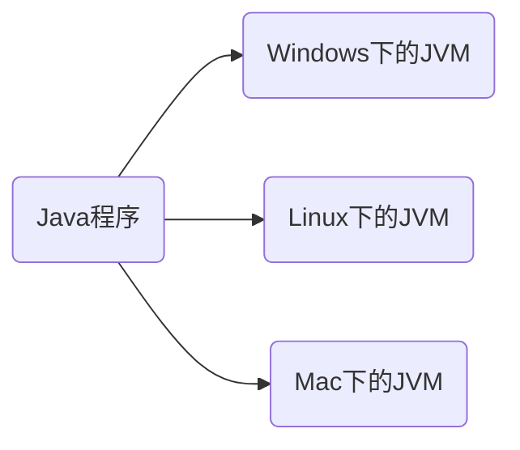
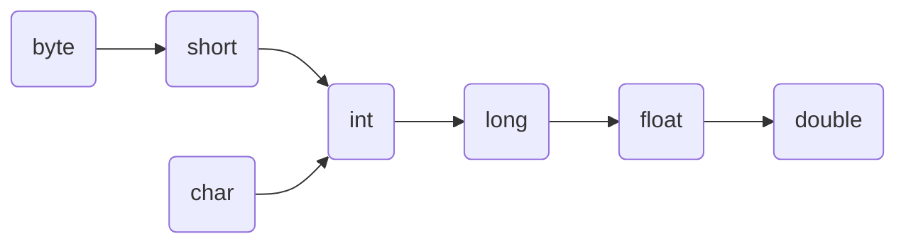
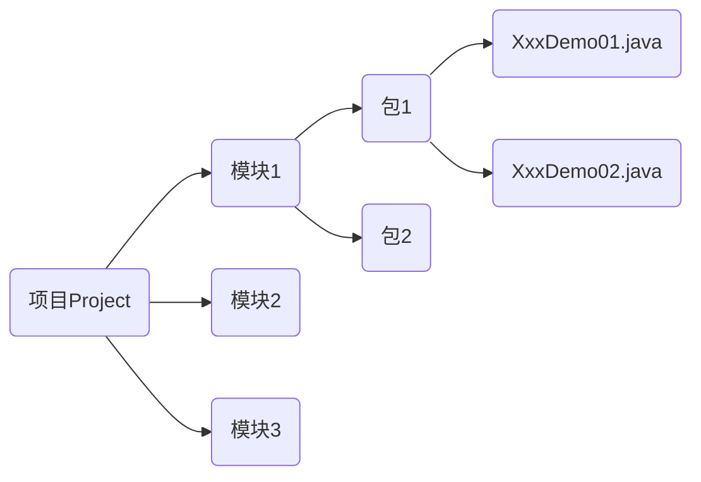

# 第一章 开发前言

## 位、字节

- 位(bit): 一个数字0或一个数字1,代表一位

- 字节(Byte): 每逢8位是一个字节,这时数据存储的最小单位

> 1 Byte = 8 bit
>
> 1 KB = 1024 Byte
>
> 1 MB = 1024 KB
>
> 1 GB = 1024 MB
>
> 1 TB = 1024 GB
>
> 1 PB = 1024 TB

## MS-DOS(Microsoft Disk Operating System)


# 第二章 Java语言开发环境搭建

## 2.1 Java虚拟机--JVM

- <b>JVM</b>(Java Virtual Machine): Java虚拟机,简称JVM,是运行所有Java程序的假想计算机,是Java程序的运行环境,是Java最具吸引力的特性之一。我们编写的Java代码, 都运行在JVM之上
- <b>跨平台</b>: 任何软件的运行,都必须要运行在操作系统之上,而我们使用Java编写的软件可以运行在任何的操作系统上,这个特性成为<b>Java语言的跨平台性</b>。该特性是由JVM实现的,我们编写的程序运行在JVM上,而JVM运行在操作系统上



如图所示,Java的虚拟机本身不具备跨平台功能的,每个操作系统下都有不同版本的虚拟机

## 2.2 JRE和JDK

- <b>JRE</b>(Java Runtime Environment): 是Java程序的运行时环境,保护JVM和运行时所需要的核心类库
- <b>JDK</b>(Java Development Kit): 是Java程序开发工具包,保护jre和开发人员使用的工具

> 我们想运行已有的Java程序,那么只需安装JRE即可
>
> 我们想开发一个全新的Java程序,那么必须安装JDK
>
> JRE  = "运行类库" + "JVM"
>
> JDK = "编译器等开发工具" + JRE

## 2.3 安装步骤

- 下载[Java JDK 11 Windows 11.0.5](https://www.7down.com/soft/259026.html)

## 2.4 目录说明

安装好Java之后,在安装路径`D:\develop\Java\`会生成一些文件夹.下面说明各个文件夹的作用:

- bin: 存放了JDK的各种工具命令。(javac和java就放在这个目录)
- conf: 存放了JDK的相关配置文件
- include: 存放了一些平台特定的头文件
- jmods: 该路径下存放了JDK的各种模块
- legal: 存放了JDK各模块的授权文档
- lib: 存放路JDK工具的一些补充JAD包


# 第三章 常见语法

## 1 常用DOS命令

| 操作                | 说明                             |
| ------------------- | -------------------------------- |
| 盘符名称            | 盘符切换。 E: 回车,表示切换到E盘 |
| dir                 | 查看当前路径下的内容             |
| cd 目录             | 进入单级目录. cd marron          |
| cd..                | 回退到上一级                     |
| cd 目录1\目录2\ ... | 进入多级目录: cd itheima\JavaSE  |
| cls                 | 清屏幕                           |
| exit                | 退出命令提示符窗口               |

## 2 path 环境变量的配置

开发Java程序,需要使用JDK提供的开发工具,而这些工具在JDK的安装目录的bin目录下.

为了在开发Java程序的时候,能够方便的使用javac和java这些命令,我们需要配置Path环境变量.

## 3. HelloWorld案例

### 3.1 Java程序开发运行流程

开发Java程序,需要三个步骤: 编写程序,编译程序,运行程序

### 3.2 Hello World案例的编写

1. 新建文本文档文件,修改为HelloWorld.java
2. 用记事本打开HelloWorld.java文件,书写程序内容

```java
public class HelloWorld{
    public static void main(String[] args){
        System.out.println('HelloWorld')
    }
}
```

- 编译

```java
$ javac HelloWorld.java
```

- 运行

```java
$ java HelloWolrd
```

## 4. 略

## 5. Notepad软件的安装和使用(略)

## 6. 注释(略)

- 单行注释: `//`
- 多行注释: `/**/`
- 文档注释: `/** */`

## 7. 关键字

- 关键字的特定:

  - 关键字的字母全部是小写

  - 常用的代码编辑器,针对关键字有特殊的颜色标记,非常直观

    - ```java
      public class HelloWolrd{
          /*
          	这是main方法
          	main方法是程序的入口方法,代码的执行是从main方法开始的
          */
          public static void main(String[] args){
              System.out.println('marron')
          }
      }
      ```

## 8. 常量

- 常量的概述: 在程序运行过程中,其值不可以发生改变的量

- 常量的分类：

  - | 常量类型 | 说明                 | 举例                    |
    | -------- | -------------------- | ----------------------- |
    | 字符串常 | 用双引号括起来的内容 | "HelloWorld"            |
    | 整数常量 | 不带小数的数字       | 666,-88                 |
    | 小数常量 | 带小数的数字         | 13.14,-5.21             |
    | 字符常量 | 用单引号括起来的内容 | 'A','0',','我'          |
    | 布尔常量 | 布尔值,表示真假      | 只有两个值: true, false |
    | 空常量   | 一个特殊的值,空值    | 值是null                |

## 9. 数据类型

- 计算机的存储单元: 我们知道就算机是可以用来存储数据的,但是无论是内存还是硬盘,计算机设备的最小信息单元叫"位(bit)",我们又称之为"比特位",通常用小写的字母"b"表示。而计算机中最小的存储单元叫"字节(byte)",通常用大写字母"B"表示,字节是由连续的8个位组成

- Java语言是强语言类型,对于每一种数据都给出了明确的数据类型,不同的数据类型也分配了不同的内存空间,所以它们表示的数据大小也是不一样的.
  - 数据类型:
    - 基本数据类型：
      - 数值型: 
        - 整数(byte,short,int,long)
        - 浮点数(float, double)
        - 字符(char)
      - 非数值型
    - 引用数据类型:
      - 类(class)
      - 接口(interface)
      - 数组([])

- 数据类型内存占用和取值范围

| 数据类型 | 关键字  | 内存占用 | 取值范围                                                     |
| -------- | ------- | -------- | ------------------------------------------------------------ |
| 整数     | byte    | 1        | -128~127                                                     |
| 整数     | short   | 2        | -32768~32767                                                 |
| 整数     | int     | 4        | -2^31 ~ 2^31 -1                                              |
| 整数     | long    | 8        | -2^63 ~ 2^63 -1                                              |
| 浮点数   | float   | 4        | 负数: -3.402823E + 38 ~ -1.401298E -45; 正数: 1.401298E - 45 到 3.402823E + 38 |
| 浮点数   | double  | 8        | 负数: -1.797693E + 308 ~ -4.9000000E - 324; 正数: 4.900000000E - 324 到1797693E + 308 |
| 字符     | char    | 2        | 0~65535                                                      |
| 布尔     | boolean | 1        | true, false                                                  |

## 10. 变量

- 变量: 在程序运行过程中,其值可以发生改变的量。 从本质上讲: 变量是内存中的一小块区域

- 格式: 数据类型 变量名 = 变量值; (`int a  = 10`)

- 变量使用的注意事项:
  - `VariableDemo02.java:30: 错误: 整数太大`: 告诉计算机右边的值是long类型即可

```java
long l = 10000000000L;
```

- `VariableDemo02.java:35: 错误: 不兼容的类型: 从double转换到float可能会有损失`: 告诉计算机右边的是float类型即可

```java
float f = 13.14F;
System.out.println(f);
```

## 11. 标识符

- 标识符: 就是给类,方法,变量等起名字的符号
- 标识符定义规则: 
  - 由<font color="red">数字、字母、下划线(_)和美元符($)组成</font>
  - 不能以数字开头
  - 不能是关键字
  - 区分关键字
- 常见命名约定:
  - 小驼峰命名法:
    - 标识符是一个单词的时候,首字母开头小写, name
    - 标识符是多个单词时,第一个字母开头小写,其他单词首字母大写, firstName
  - 大驼峰命名法:
    - 标识符是一个单词的时候,首字母开头大写, Student
    - 标识符是多个单词时,每个单词首字母大写, GoodStudent

## 12. 类型转换

- 自带类型转换:
  - 把一个数据范围小的数值或者变量赋值给另一个表示数据范围大的变量: `double d = 10`
  - 下面是表示数据范围从小到大图



- 常见报错:
  - `ConversionDemo.java:15: 错误: 不兼容的类型: 从byte转换到char可能会有损失`: byte无法转换位char

- 强制类型转换: 把一个表示数据范围大的数值或者变量赋值给另一个表示数据范围小的变量
  - 格式: 目标数据类型 变量名 = (目标数据类型)值或者变量
    - `int k = (int)88.88`
    - `ConversionDemo.java:18: 错误: 不兼容的类型: 从double转换到int可能会有损失`: `int k = 88.88`

## 13. 运算符

- 运算符: 对常量或者变量进行操作的符号

- 表达式: 用运算符把常量或者变量连接起来符合java语法的式子就可以成为表达式.不同运算符连接的表达式体现的是不同类型的表达式.

- 举例子:

  - ```java
    int a = 10;
    int b = 20;
    int c = a + b;
    ```

  - `+`: 是运算符,并且是算数运算符

  - `a+b`: 是表达式,由于+是算术运算符,所以这个表达式叫算数表达式

### 字符的"+"操作

拿字符在计算机底层对应的数值来进行计算的

- 'A' -> 65  (A-Z是连续的)
- 'a' -> 97  (a-z是连续的)
- '0' -> 48  (0-9是连续的)

算数表达式中包含多个基本数据类型的值的时候,整个算数表达式的类型会自动进行提升,提升规则:

- byte类型,short类型和char类型将被提升到int类型
- 整个表达式的类型自动提升到表达式中最高等级操作数同样的类型,
  - 等级顺序: byte,short,char -> int -> ling -> float -> double


[报错]:

`OperatorDemo02.java:13: 错误: 不兼容的类型: 从int转换到char可能会有损失`: 

```java
public class OperatorDemo02{
    public static void main(String[] args){
        int i = 10;
        char c = 'A';
        char ch = i + c;
        System.out.println(ch)
    }
}
```

### 字符串的"+"操作

```java
public class OperatorDemo03{
	public static void main(String[] args){
		System.out.println("Marron" + "Hao");	// MarronHao
		System.out.println("Marron" + 666);		// Marron666
		System.out.println(666 + "Marron");		// 666Marron
		System.out.println("Marron" + 6 + 66);  // Marron666
		System.out.println(1+ 99 + "年Marron");  // 100年Marron
	}
}
```

当"+"操作中出现字符串时,这个"+"是字符串连接符,而不是算数运算符

### 赋值运算符

| 符号 | 作用       | 说明                   |
| ---- | ---------- | ---------------------- |
| =    | 赋值       | a=10, 将10赋值给变量a  |
| +=   | 加后赋值   | a+=b, 将a+b的值给a     |
| -=   | 减后赋值   | a+=b, 将a-b的值给a     |
| *=   | 乘后赋值   | `a*=b`, 将`a*b`的值给a |
| /=   | 除后赋值   | a/=b, 将a➗b的商给a     |
| %=   | 取余后赋值 | a%=b, 将a➗b的余数给a   |

```java
public class OperatorDemo{
	public static void main(String[] args){
		// 把10赋值给int类型的变量i;
		int i = 10;
		System.out.println("i: " + i);
		
		// += 把左边和右边的数据做加法操作,结果赋值给左边
		i += 20;
		System.out.println("i: " + i);
		
		// 注意: 扩展的赋值运算符底层隐含了强制类型转换
		short s = 10;
		s += 20;
		System.out.println("s: " + s);
	}
}
```

扩展的赋值运算符,隐含了强制类型转换

### 自增自减运算符

| 符号 | 作用 | 说明        |
| ---- | ---- | :---------- |
| ++   | 自增 | 变量的值加1 |
| --   | 自减 | 变量的值减1 |

```java
public class OperatorDemo{
    public static void main(String[] args){
        // 定义变量
        int i = 10;
        System.out.println("i: " + i);  // 10
        
        i++;
        System.out.println("i: " + i);	// 11
    }
}
```

### 关系运算符

| 符号 | 说明                                                  |
| ---- | ----------------------------------------------------- |
| ==   | a==b, 判断a和b的值是否相等,成立为true,不成立为false   |
| !=   | a!=b, 判断a和b的值是否不相等,成立为true,不成立为false |
| >    | a>b, 判断a是否大于b,成立为true,不成立为false          |
| >=   | a>=b, 判断a是否大于或等于b,成立为true,不成立为false   |
| <    | a<b, 判断a是否小于b,成立为true,不成立为false          |
| <=   | a<=b, 判断a是否小于或等于b,成立为true,不成立为false   |

### 逻辑运算符

| 符号 | 作用     | 说明                                            |
| ---- | -------- | ----------------------------------------------- |
| &    | 逻辑与   | a&b, a和b都是true,结果为true,否则为false        |
| \|   | 逻辑或   | a\|b, a和b都是false,结果为false,否则为true      |
| ^    | 逻辑异或 | a^b, a和b不同为true,否则为false                 |
| !    | 逻辑非   | !a, a为true时,结果为false;a为false时,结果为true |

```java
/*
	逻辑运算符
*/
public class OperatorDemo01{
    public static void main(String[] args){
        // 定义变量
        int i = 10;
        int j = 20;
        int k = 30;
        
        // & 有false则false
        System.out.println( (i>j) & (i>k));	// false & false
    }
}
```

[短路逻辑运算符]

| 符号 | 作用   | 说明                      |
| ---- | ------ | ------------------------- |
| &&   | 短路与 | 作用与&相同,但有短路效果  |
| \|\| | 短路或 | 作用与\|相同,但有短路效果 |

注意事项:

- 逻辑运算符,左右两边必然执行
- 短路运算符,只有当前提条件满足了后面的才执行.


### 三元运算符

- 格式: 关系表达式? 表达式1 : 表达式2

【案例1】: 动物园里有两只老虎,已知两只老虎的体重分别为180kg、200kg,请用程序实现判断两只老虎的体重是否相同.

```java
public class OperatorTest01{
    public static void main(String[] args){
        int weight = 180;
        int weight = 200;
        
        boolean b = weight1 == weight2? true: false;
        
        System.out.println("b: " + b);
    }
}
```

【案例2】:  一座寺庙里住着三个和尚,已知他们的身高分别为150cm、210cm、165cm,请用程序实现获取者三个和尚的最高身高

```java
public class OperatorTest02{
    public static void main(String[] args){
        int height1 = 150;
        int height2 = 210;
        int height3 = 165;
        int max1 = height1 > height2 ? height1 : height2;
        int max = max1 > height3 ? max1 : height3;
        System.out.println("max: " + max);
    }
}
```

## 14. 数据输入

### scanner使用的基本步骤

```java
import java.util.Scanner;

public class ScannerDemo{
	public static void main (String[] args){
		// 创建对象
		Scanner sc = new Scanner(System.in);
		
		
		// 接收数据
		int x = sc.nextInt();
		System.out.println("x: " + x);
	}
}
```

【栗子1】:  一个寺庙住着三个和尚,他们的身高必须经过测量得出,请用程序实现获取这三个和尚的最高身高

```java
import java.util.Scanner;

public class ScannerTest{
	public static void main(String[] args){
		Scanner sc = new Scanner(System.in);
		
		int height1 = sc.nextInt();
		int height2 = sc.nextInt();
		int height3 = sc.nextInt();
		
		int tmpHeight = height1 > height2 ? height1 : height2;
		int maxHeight = tmpHeight > height3 ? tmpHeight : height3;
		
		System.out.println("maxHeight: " + maxHeight);
	}
}
```

## 15. 分支语句

### 顺序结构

顺序结构: 是程序中最简单最基本的流程控制,没有特定的语法结构,按照代码的先后顺序,依次执行,程序中大多数的代码都是这样执行的

```java
/*
	顺序结构
*/
public class OrderDemo {
    public static void main(String[] args){
        System.out.println("开始");
        
        System.out.println("语句A");
        System.out.println("语句B");
        System.out.println("语句C");
        
        System.out.println("结束");
    }
}
```

### if 语句

- if语句格式1:

```java
/*
	格式:
	if(关系表达式){
		语句体;
	}
*/
```

执行流程: 

1. 首先巨酸关系表达式的值
2. 如果关系表达式的值为true就执行语句体
3. 如果关系表达式的值为false就不执行语句体
4. 继续执行后面的语句内容

```java
public class IfDemo{
    public static void main(String[] args){
        System.out.println("开始");
        
        // 定义两个变量
        int a = 10;
        int b = 20;
        
        // 需求: 判断a和b的值是否相等,如果相等,就在控制台输出: a等于b 
        if(a == b){
            System.out.println("a等于b");
        }
        
        // 需求: 判断a和c的值是否相等,如果相等,就在控制台输出: a等于c
        if(a == c) {
            System.out.println("a等于c");
        }
        
        System.out.println("结束");
    }
}
```

- if语句格式2:

```java
/*
	格式:
	if(关系表达式){
		语句体1;
	} else {
		语句体2;
	}
*/
```

需求: 判断输入的a是否大于b.是在控制台输出"a大于b",否则输出"a不大于b"

```java
import java.util.Scanner;
public class IfDemo02{
    public static void main (String[] args){
        System.out.println("开始");
        Scanner sc = new Scanner(System.in);
        int a = sc.nextInt();
        int b = sc.nextInt();
        if(a > b){
            System.out.println("a大于b")
        } else {
            System.out.println("a不大于b")
        }
        System.out.println("结束");
    }
}
```

需求: 任意给出一个整数,请用程序实现判断该整数是奇数还是偶数,并在控制台输出该整数是奇数还是偶数.

```java
import java.util.Scanner;
public class IfDemo03{
    public static void main(String[] args){
        System.out.println("开始");
        Scanner sc = new Scanner(System.in);
       	int num = sc.nextInt();
        if(num % 2 == 0){
            System.out.println("您输入的是偶数");
        } else {
            System.out.println("您输入的是奇数");
        }
       	System.out.println("结束");	
    }
}
```

- if语句格式2:

```java
/*
	格式:
	if(关系表达式1){
		语句体1;
	} else if(关系表达式2){
		语句体2;
	}
	...
	else {
		语句体n+1;
	}
*/
```

需求: 输入整数1~7,输出星期一~星期天

```java
import java.util.Scanner;
public class IfDemo04{
    public static void main(String[] args){
        System.out.println("开始");
        Scanner sc = new Scanner(System.in);
        System.out.println("请输入一个星期数(1-7)");
        int day = sc.nextInt();
        if(day == 1){
            System.out.println("星期一");
        } else if (day == 2) {
            System.out.println("星期二");
        } else if (day == 3) {
            System.out.println("星期三");
        } else if (day == 4) {
            System.out.println("星期四");
        } else if (day == 5) {
            System.out.println("星期五");
        } else if (day == 6) {
            System.out.println("星期六");
        } else if (day == 7) {
            System.out.println("星期天");
        }
        System.out.println("结束");
    }
}
```

### switch语句

```java
/*
	格式
	switch(表达式){
		case 值1:
			语句体1;
			break;
        case 值2:
        	语句体2;
        	break;
        ...
        default:
        	语句体n+1;
        	[break;]
	}
*/
```

需求: 一年有12个月,分别属于春夏秋冬4个季节,键盘录入一个月份,请用程序实现判断该月份属于哪个季节,并输出

```java
import java.util.Scanner;
public class SwitchTest{
    public static void main(String[] args){
        Scanner sc = new Scanner(System.in);
        
        System.out.println("请输入一个月份: ");
        int month = sc.nextInt();
        
        switch(month){
            case 12:
            case 1:
            case 2:
               	System.out.println("冬季");
                break;
            case 3:
            case 4:
            case 5:
                System.out.println("春季");
                break;
            case 6:
            case 7:
            case 8:
                System.out.println("夏季");
                break;
            case 9:
            case 10:
            case 11:
                System.out.println("秋季");
                break;
            default:
                System.out.println("您输入的月份错误");
                break;
        }
    }
}
```

## 16. 循环语句

### for 循环语句

```java
/*
	格式；
	for(初始化语句; 条件判断语句; 条件控制语句){
		循环体语句;
	}
*/
```

需求1: 输出5次"HelloWorld"

```java
public class ForDemo{
    public static void main(String[] args){
        for(int i = 0; i < 5; i++){
            System.out.println("HelloWorld");
        }
    }
}
```

需求2: 在控制台输出所有的"水仙花数"

```java
public class ForTest{
    public static void main (String[] args){
		for(int i = 100; i <=999; i++){
            // 个位
            int units = i % 10;
            // 十位
            int tens = (i /10) % 10;
            // 百位
            int hundreds = i / 10/10 % 10;
            if(i == units * units * units + tens * tens * tens + hundreds * hundreds *hundreds ){
                System.out.println(i);
            }
        }        
    }
}
```

### while 循环语句

```java
/*
	格式:
	while(条件判断语句){
		循环体语句;
		条件控制语句;
	}
*/
```

需求: 世界最高山峰珠穆朗玛峰(8844.43米 = 8844430毫米), 假如我有一张足够大的纸,它的初始厚度是0.1毫米.请问,折叠多少次,可以超过珠穆朗玛峰的高度?

```java
public class whileTest{
    public static void main(String[] args){
        double maxHeight = 8844430;
        double tmpHeight = 0.1;
        int count = 0;
        while(tmpHeight < maxHeight && count < 9999){
            tmpHeight *= 2;
            count++;
        }
        System.out.println("折叠: " + count + "次后,高度为: " + tmpHeight);
    }
}
```

### do...while循环语句

```java
/*
	基本格式:
	do{
		循环体语句;
	} while(条件判断语句);
*/
```

## 17. 跳转控制语句

- `continue`: 用在循环中,基于条件控制,跳过某次循环体内容的执行,继续下次一的执行
- `break`: 用在循环体中,基于条件控制,终止循环体内容的执行,也就是说结束当前的整个循环

```java
public class ControlDemo{
    public static void main(String[] args){
        for(int i = 1; i<=5; i++){
            if(i%2 == 0){
                continue;
                // break;
            }
            System.out.println(i);
        }
    }
}
```

## 18. 循环嵌套

```java
public class ForForDemo{
    public static void main(String[] args){
        for(int hour = 0; hour<24; hour++){
            for(int minute = 0; minute<60; minute++){
                System.out.println(hour + "时" + minute + "分");
            }
            System.out.println("---------------");
        }
    }
}
```

## 19. Random

用于产生一个随机数

```java
import java.util.Random;
Random r = new Random();
int number = r.nextInt(10);
```

```java
/*
	产生10个随机数
*/
import java.util.Random;
public class RandomDemo{
    public static void main(String[] args){
        Random r = new Random();
        
        for(int i = 0; i< 10; i++){
            int number = r.nextInt(10);
            System.out.println("number: " + number);
        }
        
        // 生成一个 0~100之间的随机数(包含0, 不包含100)
        int x = r.nextInt(100);
    }
}
```

【栗子】: 猜数字: 使用Random函数生成一个1~100之间的数,然后等待玩家输入数字.若比生成的大则提示猜大了,若小则提示猜小,否则提示"bingo"

```java
import java.util.Random;
import java.util.Scanner;
public class RandomTest{
    public static void main(String[] args){
        Random r = new Random();
        Scanner sc = new Scanner(System.in);
        // 生成随机数
        int num = r.nextInt(100) + 1;

		while(true){
			System.out.println("请输入1~100");
			int guess = sc.nextInt();
			if(guess > num) {
				System.out.println("猜大了");
			} else if (guess < num){
				System.out.println("猜小了");
			} else {
				System.out.println("恭喜你猜中了");
				break;
			}
		}
    }
}
```

# 第四章 IDEA概述和安装

IDEA全称`IntelliJ IDEA`是Java语言开发的集成环境,它是业界公认的目前用于Java程序开发最好的工具.

- 集成环境: 把代码编写,编译,执行,调试等多种功能综合到一起的开发工具

- IDEA的下载和安装:
  - 下载: `https://www.jetbrains.com/idea/`
  - 安装: 傻瓜式安装,建议修改安装路径

## IDEA中创建一个项目

1. 创建一个空项目(JavaSE_Code)
2. 创建一个新模块(idea_test)
3. 在idea_test模块下的src中创建一个包(com.marron)
4. 在com.marron包下新建一个类(HelloWorld)
5. 在HelloWorld类中编写代码
6. 在idea中执行程序

## IDEA中的项目结构

- 在IDEA中是以项目为单位管理应用程序的.
- 一个项目包含多个模块
- 一个模块包含多个包
- 一个包包含多个类



### IDEA中常用的快捷键

- 格式化: 'Ctrl + alt + L'
- 注释: 'ctrl + /'
- 行移动: 'alt + shift + 上下箭头'
- 复制行: 'ctrl + D'

### IDEA中模块操作

- 新建模块:
  - File -> Project Structure -> New Module -> `+号` ->  New Module ->选则JDK -> 修改模块名

- 删除模块:
  - 选择需要删除的模块 -> Remove Module
  - 以上删除,模块只是在IDEA中不显示,在硬盘上还是存在的.需要到模块对应的目录删除
- 导入模块:
  - File -> Project Structor -> `+号` -> Import Module -> 

# 第五章 数组

## 数组的定义格式

数组: 是一种用于存储多个相同类型数据的存储模型

```java
/*
	格式1:
	数据类型[] 变量名
	int[] arr
	
	解读: 定义了一个int类型的数据,数组名是arr
*/

```

```java
/*
	格式2:
	数据类型 变量名[]
	int arr[]
	
	解读: 定义了一个int类型的变量,变量名是arr数组
*/
```

## 数组初始化之动态初始化

Java中的数组必须先初始化,然后才能使用

所谓初始化: 就是为数组中的数组元素分配内存空间,并为每个数组元素赋值

### 动态初始化

初始化时只指定数组长度,由系统为数组分配初始值

- 格式: 数据类型[] 变量名 = new 数组类型[数组长度]
- 范例: int[] arr = new int[3]

```java
public class ArrayDemo {
    public static void main(String[] args) {
        int[] arr = new int[3];


        // 输出数组名
        System.out.println(arr);  // [I@58ceff1
        System.out.println(arr[0]);
        System.out.println(arr[1]);
        System.out.println(arr[2]);
    }
}
```

### 内存分配

Java程序在运行时,需要在内存中分配空间。为了提高运算效率,就对空间进行了不同区域的划分,因为每一片区域都有特定的处理数据方式和内存管理方式.看下面一段代码:

```java
int[] arr = new int[3];
System.out.println(arr);
System.out.println(arr[0]);
System.out.println(arr[1]);
System.out.println(arr[2]);
```

【栈内存】: 存储局部变量定义在方法中的变量,例如arr使用完毕,立即消失

【堆内存】: 存储new出来的内容(实体、对象)

数组在初始化时,会为存储空间添加默认值:

- 整数: 默认值0
- 浮点数: 默认值0.0
- 布尔值: 默认值是false
- 字符: 默认值是空字符
- 引用数据类型: 默认值是null

每一个new出来的东西都有一个地址值,使用完毕,会在垃圾回收器空闲时被回收

### 数组内存图(单个数组)

```java
public class ArrarTest01{
    public static void main(String[] args){
        // 定义一个数组
        int[] arr = new int[3];
        
        // 输出数组名及元素
        System.out.println(arr);
        System.out.println(arr[0]);
        System.out.println(arr[1]);
        System.out.println(arr[2]);
        
        // 给数组中的元素赋值
        arr[0] = 100;
        arr[2] = 200;
        
        // 再次输出数组名及元素
        System.out.println(arr);
        System.out.println(arr[0]);
        System.out.println(arr[1]);
        System.out.println(arr[2]);
    }
}
```

###  数组内存图(多个数组)

```java
public class ArrayTest02{
    public static void main(String[] args){
        // 定义两个数组
        int[] arr = new int[2];
        int[] arr2 = new int[3];
        
        // 分别输出数组名及元素
        System.out.println(arr);
        System.out.println(arr[0]);
        System.out.println(arr[1]);
        
        System.out.println(arr2);
        System.out.println(arr[0]);
        System.out.println(arr[2]);
        
        // 然后分别给数组中的元素赋值
        arr[0] = 100;
        arr2[0] = 200;
        arr2[2] = 300;
        
        // 分别再次输出
        System.out.println(arr);
        System.out.println(arr[0]);
        System.out.println(arr[1]);
        
        System.out.println(arr2);
        System.out.println(arr[0]);
        System.out.println(arr[2]);
        
    }
}
```

### 数组内存图(多个数组指向相同)

```java
public class ArrayTest03{
    public static void main(String[] args){
        // 定义一个数组
        int[] arr = new int[3];
        arr[0] = 100;
        arr[1] = 200;
        arr[2] = 300;
        System.out.println(arr);
        System.out.println(arr[0]);
        System.out.println(arr[1]);
        System.out.println(arr[2]);
        
        // 定义第二个数组指向第一个数组
        int[] arr2 = arr;
        arr2[0] = 111;
        arr2[1] = 222;
        arr2[2] = 333;
        // 输出两个数组的名及元素
        System.out.println(arr);
        System.out.println(arr[0]);
        System.out.println(arr2);
        System.out.println(arr2[0]);
    }
}
```

## 数组初始化之静态初始化

静态初始化: 初始化时指定每个数组元素的初始值,由系统决定数组长度

```java
int[] arr= new int[]{1,2,3};

// 简写
int[] arr= {1,2,3};
```

## 数组操作的两个常见小问题

### 索引越界

访问了数组中不存在的索引对应的元素,造成索引越界问题

```java
int[] arr = new int[3];
System.out.println(arr[3]);  // 数组越界
```

### 空指针异常

访问的数组已经不再指向堆内存的数据,造成空指针异常

```java
int[] arr = new int[3];
arr = null;
System.out.println(arr[0]);
```

## 数组常见操作

### 遍历

```java
public class ArrayTest01{
    public static void main(String[] args){
        int[] arr = {11, 22, 33, 44, 55};
        
        for(int i = 0;i < arr.length; i++){
            System.out.println(arr[i]);
        }
    }
}
```

### 获取最值

```java
public class ArrayTest02{
    public static void main(String[] args){
        int[] arr = {12, 45, 98, 73, 60};
        
        int max  = arr[0];
        for(int i = 1; i< arr.length; i++){
			if(arr[i] > max){
                max = arr[i];
            }            
        }
        System.out.println(max);
    }
}
```

# 第六章 方法

## 什么是方法

方法是将具有独立功能的代码块组织成为一个整体,使其具有特殊功能的代码集

注意:

- 方法必须先创建才可以使用,该过程成为方法定义
- 方法创建后并不是直接运行的,需要手动使用后才执行,该过程成为方法调用.

## 方法的定义和调用

```java
public class MethodDemo{
    public static void main(String[] args){
        isEvenNumber();
    }
    // 需求: 定义一个方法,在方法中定义一个变量,判断该数据是否是偶数
    public static void isEvenNumber(){
        // 定义变量
        int number = 10;
        if(number %2 == 0){
            System.out.println("true")
        } else {
            System.out.println("false");
        }
    }
}
```

流程梳理:

- 首先会加载main方法中的代码块
- 当遇到`isEventNumber`时,会去寻找`isEvenNumber`方法,并进入到该方法
- 执行完`isEventNumber`之后,会返回执行环境给main函数

【栗子】: 设计一个方法,用于打印两个数中的较大数

```java
public class MethodTest{
    public static void main(String[] args){
        printMax(10, 20);
    }
    public static void printMax(int x, int y){
        if(x > y){
            System.out.println(x);
        } else {
            System.out.println(y);
        }
    }
}
```

## 带参数方法的定义和调用

方法定义时,注意:

- 参数中的数据类型与变量名都不能缺少,缺少任意一个程序将报错
- 多个参数之间使用逗号分隔.

【栗子】: 定义一个方法,接收一个参数,判断这个数是否为偶数

```java
public class MehtodTest01{
    public static void main(String[] args){
        isEvent(15);
    }
    public static void isEvent(int x){
        if(x % 2 == 0){
            System.out.println(true);
        } else {
            System.out.println(false);
        }
    }
}
```

## 方法的注意事项

- 方法不能嵌套定义

```java
// 错误的演示
public static void methodOne(){
    // 代码块1
    public static void methodTwo(){
        // 代码块2
    }
}

// 正确的定义
public static void methodOne(){
    // 代码块1
}
public static void methodTwo(){
    // 代码块2
}
```

- void表示无返回值,可以省略return,也可以单独的书写return,后面不加数据

```java
public static void methodDemo{
    // 代码片段,省略return
}

// 或
public static void methodDemo{
    // 代码片段
    return;
}
```

## 方法的通用格式

```java
/*
	public static 返回值类型 方法名(参数){
		方法体;
		return 数据;
	}
*/
```

## 方法重载

```java
public class MethodDemo{
    public static int sum(int a, int b){
        return a + b;
    }
    public static int sum(int a, int b, int c) {
        return a + b + c;
    }
}
```

方法重载: 同一个类中定义的多个方法之间的关系,满足下列条件的多个方法相互构成重载

- 多个方法在同一个类中
- 多个方法具有相同的方法名
- 多个方法的参数不同(数量或类型不同)

【方法重载的特点】

- 重载仅对应方法的定义,与方法的调用无关,调用方式参照标准格式
- 重载仅针对同一个类中方法的名称与参数进行识别,与返回值无关,换句话说不能通过返回值来判定两个方法是否相互构成重载.

```java
// 以下两个未构成重载
public class MethodDemo{
    public static void fn(int a) {
        // 方法体
    }
    public static int fn(int a) {
        // 方法体
    }
}
```

【栗子】: 使用方法重载的思想,设计比较两个整数是否相同的方法,兼容全整数类型(byte, short, int, long)

```java
public class MethodTest01{
    public static void main(String[] args){
        System.out.println(compare(10, 20));
        System.out.println(compare((byte) 10, (byte) 20));
        System.out.println(compare((short) 10,(short) 20));
        System.out.println(compare(10L, 20L));
    }
    public static boolean compare(int a, int b){
        return a == b;
    }
    public static boolean compare(byte a, byte b){
        return a == b;
    }
    public static boolean compare(short a, short b){
        return a == b;
    }
    public static boolean compare(long a, long b){
        return a == b;
    }
}
```

## 方法的参数传递

### 基本类型

```java
public class ArgsDemo01{
    public static void main(String[] args){
        int number = 100;
        System.out.println('调用change方法前:' + number);
        change(number);
        System.out.println('调用change方法后:' + number);
    }
    public static void change(int number){
        number = 200;
    }
}
```

对于基本数据类型的参数,形式参数的改变,不影响实际参数的值

### 引用类型

```java
public class ArgsDemo02{
    public static void main(String[] args){
        int[] arr = {10, 20, 30};
        System.out.println('调用change方法前:' + arr[1]);
        change(arr);
        System.out.println('调用change方法后:' + arr[1]);
    }
    public static void change(int[] arr) {
        arr[1] = 200;
    }
}
```

对于引用类型的参数,形式参数的改变,影响实际参数的值

【栗子1】: 设计一个方法用于数组遍历,要求遍历的结果是在一行上的。例如:[11, 22, 33, 44, 55]

>System.out.prinln(): 输出内容换行
>
>System.out.print(): 输出内容不换行

```java
public class MethodTest01 {
    public static void main(String[] args) {
        int[] arr = {11, 22, 33, 44, 55};
        printArray(arr);
    }

    public static void printArray(int[] arr) {
        System.out.print("[");
        for (int i = 0; i < arr.length; i++) {
            if (i != arr.length - 1) {
                System.out.print(arr[i] + ", ");
            } else {
                System.out.print(arr[i]);
            }

        }
        System.out.print("]");
    }
}
```

【栗子2】: 设计一个方法用于获取数组中元素的最大值,调用方法并输出结果

```java
public class MethodTest02 {
    public static void main(String[] args) {
        int[] arr = {1, 3, 5, 4, 2, 8, 9};
        System.out.println(getMax(arr));
    }

    public static int getMax(int[] arr) {
        int max = arr[0];
        for (int i = 1; i < arr.length; i++) {
            if (arr[i] > max) {
                max = arr[i];
            }
        }
        return max;
    }
}
```

【栗子3】: 输入星期数,显示今天的减肥活动(周一: 跑步, 周二: 游泳, 周三: 慢走, 周四: 动感单车, 周五: 拳击, 周六: 爬山, 周日: 好好吃一顿)

```java
public class Test01 {
    public static void main(String[] args) {
        Scanner sc = new Scanner(System.in);
        System.out.println("请输入星期数: ");
        int day = sc.nextInt();
        while (day < 1 || day > 7) {
            System.out.println("请输入整数 1~7");
            day = sc.nextInt();
        }
        if (day == 1) {
            System.out.println("跑步");
        }
        if (day == 2) {
            System.out.println("游泳");
        }
        if (day == 3) {
            System.out.println("慢走");
        }
        if (day == 4) {
            System.out.println("动感单车");
        }
        if (day == 5) {
            System.out.println("拳击");
        }
        if (day == 6) {
            System.out.println("爬山");
        }
        if (day == 7) {
            System.out.println("好好吃一顿");
        }
    }
}
```

【栗子4】： 朋友聚会的时候可能会玩一个游戏: 逢七过。规则是: 从任意一个数字开始报数,当你要报的数字包含7或者是7的倍数时都要说: 过.为了帮助大家更好的玩这个游戏,这里我们直接在控制台打印1~100之间的满足逢七过规则的数据.

```java
public class Test02 {
    public static void main(String[] args) {
        for (int i = 1; i < 100; i++) {
            if (i % 7 == 0 || i / 10 % 10 == 7 || i % 10 == 7) {
                System.out.println(i);
            }
        }
    }
}
```

【栗子5】: 有一对兔子,从出生后第3个月起每个月都生一对兔子,小兔子长到第3个月后每个月又生一对兔子,假如兔子都不死,问第二十个月的兔子对数为多少?

思路: 

第1个月兔子对数为 1 对

第2个月兔子对数为 1 对

第3个月兔子对数为 2 对

第4个月兔子对数为 3 对

第5个月兔子对数为 5 对

即 a[n] = a[n-1] + a[n-2];用动态规划

```java
public class Test03 {
    public static void main(String[] args) {
        int[] arr = new int[20];
        arr[0] = 1;
        arr[1] = 1;
        for (int i = 2; i < 20; i++) {
            arr[i] = arr[i - 1] + arr[i - 2];
        }
        System.out.println(arr[19]);
    }
}
```

【栗子6】: 我国古代数学家张丘建在《算经》一书中提出的数学问题: 鸡翁一值钱五,鸡母一值钱三,鸡雌三值钱一。问鸡翁、鸡母、鸡雌各几何?

> 思路：
>
> 假设 鸡翁、鸡母、鸡雌 的数量各为 x , y, z 有以下等式成立
>
> x + y + z = 100
>
> 5*x + 3*y + z/3 = 100
>
> 0<= x <= 20
>
> 0<=y <= 33
>
> 0<= z <= 100
>
> 循环遍历 x和y, 让 z = 100 - x - y; 然后z要能整除3 以及 满足等式 5*x + 3*y + z/3 = 100

```java
public class Test04 {
    public static void main(String[] args) {
        for (int x = 0; x <= 20; x++) {
            for (int y = 0; y <= 33; y++) {
                int z = 100 - x - y;
                if (z % 3 == 0 && 5 * x + 3 * y + z / 3 == 100) {
                    System.out.println(x + " " + y + " " + z);
                }
            }
        }
    }
}
```

# 第七章 类和对象

万物皆对象,客观存在的事物皆称为对象

## 什么是类

**类**: 是对现实生活中一类具有共同属性和行为的事物的抽象

类的特点:

- 类是对象的数据类型
- 类是具有相同属性和行为的一组对象的集合

**对象**: 是能够看得见摸得着的真实存在的实体

**对象的属性**: 对象具有各种特征,每个对象的每个属性都有特定的值

**对象的行为**: 对象能够执行的操作

## 类的定义

类的重要性: 是Java程序的基本组成单位

- **类的组成**: 属性和行为
  - 属性: 在类中通过成员变量来体现(类中方法外的变量)
  - 行为: 在类中通过成员方法来体现(和前面的方法相比去掉static关键字即可)

```java
/*

模板
public class 类型{
    // 成员变量
    变量1的数据类型 变量1;
    变量2的数据类型 变量2;
    ...
        
    // 成员方法
    方法1;
    方法2;
    ...
}

*/

// 栗子如下
public class Phone {
    // 成员变量
    String brand;
    int price;

    // 成员方法
    public void call() {
        System.out.println("打电话");
    }

    public void sendMessage() {
        System.out.println("发短信");
    }
}
```

## 对象的使用

- 创建对象：
  - 格式: 类名 对象名 = new 类名();
  - 范例: Phone p = new Phone();
- 使用对象:
  - 使用成员变量:
    - 格式: 对象名.变量名
    - 范例：p.brand
  - 使用成员方法:
    - 格式: 对象名.方法名()
    - 范例: p.call()

```java
public class PhoneDemo {
    public static void main(String[] args) {
        // 创建对象
        Phone p = new Phone();

        // 使用成员变量
        System.out.println(p.brand);
        System.out.println(p.price);

        p.brand = "华为";
        p.price = 2999;

        System.out.println(p.brand);
        System.out.println(p.price);

        // 使用成员方法
        p.call();
    }
}
```

【栗子】: 首先定义一个学生类,然后定义一个学生测试类,在学生测试类中通过对象完成成员变量和成员方法的使用

```java
// Student.java
public class Student{
    // 成员变量
    String name;
    int age;
    
    // 成员方法
    public void study(){
        Syste.out.println("好好学习,天天向上");
    }
    
    public void doHomework(){
        System.out.println("代码敲烂,月薪过万");
    }
}
```

```java
// StudentDemo.java
public class StudentDemo{
    public static void main(String[] args){
        Student s = new Student();
        
        System.out.println(s.name + "," + s.age);
        
        s.name="林青霞";
        s.age = 30;
        
        System.out.println(s.name + "," + s.age);
        
        s.study();
        s.doHomework();
    }
}
```

### 多个对象指向相同

```java
public class StudentTest03{
    public static void main(String[] args){
        Student s1 = new Student();
        s1.name = "林青霞";
        s1.age = 30;
        System.out.println(s1.name + "," + s1.age);
        
        Student s2 = s1;
        s2.name = "张曼玉";
        s2.age = 28;
        System.out.println(s1.name + "," + s1.age);
        System.out.println(s2.name + "," + s2.age);
    }
}
```

## 成员变量和局部变量

```java
public class Student {
    String name;
    
    public void study(){
        int i = 0;
        System.out.println("好好学习");
    }
    
    public void doHomework(){
        System.out.println("多做练习");
        int j = 0;
    }
    
    int age;
}
```

**成员变量**: 类中方法外的变量

**局部变量**： 方法中的变量

| 区别           | 成员变量                                  | 局部变量                                      |
| -------------- | ----------------------------------------- | --------------------------------------------- |
| 类中位置不同   | 类中方法外                                | 方法内或者方法声明上                          |
| 内存中位置不同 | 堆内存                                    | 栈内存                                        |
| 生命周期不同   | 随着对象的存在而存在,随着对象的消失而消失 | 随着方法的调用而存在,随着方法的调用完毕而消失 |
| 初始值不同     | 有默认的初始化值                          | 没有默认的初始化值,必须先定义,赋值,才能使用   |

## 封装

### private

- 是一个权限修饰符
- 可以修饰成员(成员变量和成员方法)
- 作用是保护成员不被别的类使用,被private修饰的成员只能在本类中才能访问

>针对private修饰的成员变量,如果需要被其他类使用,提供相应的操作
>
>- 提供"get变量名()"方法,用于获取成员变量的值,方法用public修饰
>- 提供"set变量名(参数)"方法,用于设置成员变量的值,方法用public修饰

【栗子】:

```java
// Student.java
public class Student{
    String name;
    int age;
    
    public void show(){
        System.out.println(name + "," + age);
    }
}

// 使用private关键字
public class Student {
    String name;
    private int age;
    
    // 提供get/set方法
    public void setAge(int a){
        if(a < 0 || a > 180){
            System.out.println("您给的年龄有误");
        } else {
            age = a;
        }
    }
    
    public int getAge(){
        return age;
    }
    
    public void show(){
        System.out.println(name + "," + age);
    }
}
```

### this

```java
public class Student {
    private String name;
    
    public void setName(String name){
        this.name = name;
    }
    
    public void show(){
        System.out.println(this.name);
    }
}

public class StudentDemo{
    public static void main(String[] args){
        Student s = new Student();
        s.setNmae("Marron");
        s.show();
    }
}
```

- this修饰的变量用于指代成员变量

  - 方法的形参与成员变量同名,不带this修饰的变量指的是形参,而不是成员变量

  - ```java
    public class Student{
        private String name;
        
        public String getName(){
            return name;
        }
        public void setName(String name){
            // 此处name指向形参,this.name执行成员变量
            this.name = name;
        }
    }
    ```

  - 方法的形参没有与成员变量同名,不带this修饰的变量指的是成员变量

### 小结

1. 封装概述

面向对象三大特征之一(封装、继承、多态)

是面向对象编程语言堆客观世界的模拟,客观世界成员变量都是隐藏在对象内部的,外界无法直接操作的

2. 封装原则

将类的某些信息隐藏在类内部,不允许外部程序直接访问,而是通过该类提供的方法来实现堆隐藏信息的操作和访问成员变量private,提供对应的getXxx()/setXxx()方法

```java
public class Student{
    private String name;
    
    public String getName(){
        return name;
    }
    
    public void setNamee(String name) {
        this.name = name;
    }
}
```

3. 封装的好处

通过方法来控制成员变量的操作,提高了代码的安全性

把代码用方法进行封装,提高了代码的复用性

## 构造方法

构造方法是一种特殊的方法,其作用是用来创建对象

```java
/*
	格式:
	public class 类名{
		修饰符 类名(参数) {
			...
		}
	}
*/
```

功能: 主要是完成对象数据的初始化

```java
public class Student {
    private String name;
    private int age;

    // 构造方法
    public Student(){
        System.out.println("无参构造方法");
    }

    public void show() {
        System.out.println(name + "," + age);
    }
}
```

- 下面使用重载和封装的思想定义一个Student类

```java
public class Student {
    private String name;
    private int age;

    public Student() {

    }

    public Student(String name) {
        this.name = name;
    }

    public Student(int age) {
        this.age = age;
    }

    public Student(String name, int age) {
        this.name = name;
        this.age = age;
    }

    public void show() {
        System.out.println(name + "," + age);
    }
}
```

## 标准类制作

- 成员变量: 使用private修饰
- 构造方法: 提供一个无参构造方法,提供一个带多个参数的构造方法
- 成员方法:
  - 提供每一个成员变量对应的setXxx()/getXxx()
  - 提供一个显示对象信息的show()
- 创建对象并为其成员变量赋值的两种方式
  - 无参构造方法创建后使用setXxx()赋值
  - 使用带参数构造方法直接创建带有属性值得对象

# 第八章 字符串

## API

API(application programing interface): 应用程序编程接口

编写一个机器人程序去控制机器人踢足球,程序需要向机器人发出向前跑、向后跑、射门、抢球等各种命令。机器人厂商提供一些用于控制机器人的接口类,这些类中定义好了操作机器人的各种动作的方法。其实,这些接口类就是机器人厂商提供给应用程序编程的接口,大家把这些类称为API


Java API: 指的就是JDK中提供的各种功能的Java类

## String

String类代表字符串,Java程序中的所有字符串文字(例如"abc")都被视为此类的实例。也就是说,Java程序中所有的双引号字符串,都是String类的对象


**字符串的特点**: 

- 字符串不可变,它们的值在创建后不能被更改

- 虽然String的值是不可改变的,但是它们可以被共享
- 字符串效果上相当于字符数组(char[]),但是底层原理是字节数组(byte[])


## String构造方法(常用)

| 方法名                    | 说明                                     |
| ------------------------- | ---------------------------------------- |
| public String()           | 创建一个空白字符串对象,不含有任何内容    |
| public String(char[] chs) | 根据字符数组的内容,来创建字符串对象      |
| public String(byte[] bys) | 根据字节数组的内容,来创建字符串对象      |
| String s = "abc";         | 直接赋值的方式创建字符串对象,内容就是abc |

```java
public class StringDemo01 {
    public static void main(String[] args) {
        String s1 = new String();
        System.out.println("s1: " + s1);


        char[] chs = {'a', 'b', 'c'};
        String s2 = new String(chs);
        System.out.println("s2: " + s2);

        byte[] bys = {97, 98, 99};
        String s3 = new String(bys);
        System.out.println("s3: " + s3);

        String s4 = "abc";
        System.out.println("s4: " + s4);
    }
}
```

## String对象的特点

- 通过new创建字符串对象,每一次new都会申请一个内存空间,虽然内容相同,但是地址值不同

```java
char[] chs = {'a', 'b', 'c'};
String s1 = new String(chs);
String s2 = new String(chs);
System.out.println(s1 == s2);
```

- 以 ”“方式给出的字符串,只要字符序列相同(顺序和大小),无论在程序代码中出现几次,JVM只会建立一个String对象,并在字符串池中维护

```java
String s3 = "abc";
String s4 = "abc";
System.out.println(s3 == s4);
/*
	在以上代码中,针对第一行代码,JVM会建立一个String对象放在字符串池中,并给s3参考;
	第二行则让s4直接参考字符串池中的String对象,也就是说它们本质上是同一个对象
*/
```

## 字符串的比较

使用`==`做比较

- 基本类型: 比较的是<font color="red">数据值</font>是否相同
- 引用类型: 比较的是<font color="red">地址值</font>是否相同

字符串是对象,它比较内容是否相同,是通过一个方法来实现的,这个方法叫: <font color="red">equals()</font>

- public boolean <font color="red">equals(Object anObject)</font>: 将此字符串与指定对象进行比较。由于我们比较的是字符串对象,所以参数直接传递一个字符串

```java
public class StringDemo02{
    public static void main(String[] args){
        // 构造方法的方式得到对象
        char[] chs = {'a', 'b', 'c'};
        String s1 = new String(chs);
        String s2 = new String(chs);
        
        // 直接赋值的方式得到对象
        String s3 = "abc";
        String s4 = "abc";
        
        // 比较字符串是否相同
        System.out.println(s1.equals(s2));
        System.out.println(s1.equals(s3));
        System.out.println(s1.equals(s4));
    }
}
```

## 几个小栗子

### 【栗子1】: 简单登录比较

已知用户名和密码,请用程序实现模拟用户登录。总共给三次机会,登录之后会,给出相应的提示

```java
public class StringTest01 {
    public static void main(String[] args) {
        // 已知用户名和密码,定义两个字符串即可
        String username = "marron";
        String password = "lzhhc";

        for (int i = 3; i > 0; i--) {


            Scanner sc = new Scanner(System.in);
            System.out.println("请输入用户名: ");
            String name = sc.nextLine();
            System.out.println("请输入密码: ");
            String pwd = sc.nextLine();

            if (name.equals(username) && pwd.equals(password)) {
                System.out.println("登录成功");
                break;
            } else {
                if (i - 1 == 0) {
                    System.out.println("登录失败");
                } else {
                    System.out.printf("登录失败,你还有" + (i - 1) + "次机会");
                }
            }
        }

    }
}
```

### 【栗子2】:  遍历字符串

```java
public class StringTest02 {
    public static void main(String[] args) {
        Scanner sc = new Scanner(System.in);
        System.out.println("请输入字符串: ");
        String line = sc.nextLine();

        for (int i = 0; i < line.length(); i++) {
            System.out.println(line.charAt(i));
        }
    }
}
```

### 【栗子3】: 统计字符次数

需求: 键盘录入一个字符串,统计该字符串中大写字母字符,小写字母字符,数字字符出现的次数(不考虑其他字符)

```java
public class StringTest03 {
    public static void main(String[] args) {
        Scanner sc = new Scanner(System.in);
        System.out.println("请输入字符串");
        String print = sc.nextLine();
        int upper = 0;
        int lower = 0;
        int number = 0;

        for (int i = 0; i < print.length(); i++) {
            char ch = print.charAt(i);
            if ('0' <= ch && ch <= '9') {
                number++;
            }
            if ('a' <= ch && ch <= 'z') {
                lower++;
            }
            if ('A' <= ch && ch <= 'Z') {
                upper++;
            }
        }
        System.out.println("大写字母个数为: " + upper);
        System.out.println("小写字母个数为: " + lower);
        System.out.println("数字个数为: " + number);
    }
}
```

### 【栗子4】: 拼接字符串

需求: 定义一个方法,把int数组中的数据按照指定的格式拼接成一个字符串返回,调用该方法,并在控制台输出结果。

例如: 数组为 int[] arr = {1, 2, 3}, 执行方法后的输出结果为: [1, 2, 3];

```java
public class StringTest04 {
    public static void main(String[] args) {
        int[] arr = {1, 2, 3};
        System.out.println(arr2String(arr));
    }

    public static String arr2String(int[] arr) {
        String str = "";
        str += "[";
        for (int i = 0; i < arr.length; i++) {
            if (i != arr.length - 1) {
                str += arr[i] + ", ";
            } else {
                str += arr[i];
            }
        }
        str += "]";
        return str;
    }
}
```

### 【栗子5】: 字符串反转

需求: 定义一个方法,实现字符串反转。键盘录入一个字符串,调用该方法后,再控制台输出结果.

例如,键盘录入abc,输出结果cba

```java
public class StringTest05 {
    public static void main(String[] args) {
        Scanner sc = new Scanner(System.in);
        System.out.println("请输入一个字符串");
        String str = sc.nextLine();
        System.out.printf(reverseStr(str));
    }

    public static String reverseStr(String s) {
        String tmpS = "";
        for (int i = s.length() - 1; i >= 0; i--) {
            tmpS += s.charAt(i);
        }
        return tmpS;
    }
}
```

## String常用方法

| 方法                                   | 说明                                          |
| -------------------------------------- | --------------------------------------------- |
| public boolean equals(Object anObject) | 比较字符串的内容,严格区分大小写(用户名和密码) |
| public char charAt(int index)          | 返回指定索引处的char值                        |
| public int length()                    | 返回此字符串的长度                            |

## StringBuilder

```java
Public static void main(String[] args){
    String s = "hello";
    s += "world";
    System.out.println(s);
}
```

首先在栈内存中加载方法: main

然后执行 `String s = "hello"`.

- 会在堆内存的常量池创建一个"hello",编号为001
- 将001赋值给s

然后执行 `s += "world"`

- 会在堆内存的常量池创建一个"world",编号为002
- 在堆内存的常量池创建一个"helloworld",编号003
- 将003赋值给s

最后执行"System.out.println(s)"

- 输出s时,会根据003找到"helloworld",然后输出

如果堆字符串进行拼接操作,每次拼接,都会构建一个新的String对象,既耗时,又浪费内存空间,而这种操作还不可避免。可以使用Java提供的 StringBuilder类来解决这个问题。

> StringBuilder是一个可变的字符串类,我们可以把它看成是一个容器,这里的可变指的是StringBuilder对象中的内容是可变的

| 方法名                           | 说明                                      |
| -------------------------------- | ----------------------------------------- |
| public String Builder()          | 创建一个空白可变字符串对象,不含又任何内容 |
| public StringBuilder(String str) | 根据字符串的内容,来创建可变字符串对象     |

```java
public class StringBuilderDemo01{
    public static void main(String[] args){
        StringBuilder sb = new StringBuilder();
        System.out.println("sb: " + sb);	// 
        System.out.println("sb.length(): " + sb.length());	// 0
        
        StringBuilder sb2 = new StringBuilder("hello");
        System.out.println("sb2: " + sb2);	// "hello"
        System.out.println("sb2.length(): " + sb2.length());	// 5
    }
}
```

| 方法名                                | 说明                    |
| ------------------------------------- | ----------------------- |
| public StringBuilder append(任意类型) | 添加数据,并返回对象本身 |
| public StringBuilder reverse()        | 返回相反的字符序列      |

```java
public class StringBuilderDemo01{
    public static void main(String[] args){
        // 创建对象
        StringBuilder sb = new StringBuilder();
        
        StringBuilder sb2 = sb.append("hello");
        
        System.out.println("sb: " + sb);	// "hello"
        System.out.println("sb2: " + sb2);	// "hello"
        System.out.prtinln(sb == sb2);		// true
        
        sb.append("hello");
        sb.append("world");
        sb.append("java");
        sb.append(100);
        
        /*	链式编程
        	sb.append("hello").append("world").append("java").append(100);
        */
        
        System.out.println("sb: " + sb);	// helloworldjava100
        sb.reverse();
        System.out.println("sb: " + sb);	// 001avajdlrowolleh
    }
}
```

## StringBuilder和String相互转换

**StringBuilder转换为String**:

- public String toString(): 通过toString()就可以实现把StringBuilder转换为String

**String转换为StringBuilder**

- public StringBuilder(String s): 通过构造方法就可以实现把String转换为StringBuilder

```java
public class StringBuilderDemo02{
    public static void main(String[] args){
        StringBuilder sb = new StringBuilder();
        sb.append("hello");
        
        // StringBuilder转换为String
        String s = sb.toString();
        System.out.println(s);
        
        // String转换为StringBuilder
        String s = "hello";
        StringBuilder sb = new StringBuilder(s);
        System.out.println(sb);
        
    }
}
```

## StringBuildr小栗子

### 【栗子1】: 拼接字符串

需求: 定义一个方法,把int数组中的数据按照指定的格式拼接成一个字符串返回,调用该方法,并在控制台输出结果.

例如: 数组为int[] arr = {1, 2, 3}; 执行方法后的输出结果为: [1, 2, 3] 

```java
public class StringBuilderTest01 {
    public static void main(String[] args) {
        int[] arr = {1, 2, 3};
        System.out.printf(arr2String(arr));

    }

    public static String arr2String(int[] arr) {
        StringBuilder sb = new StringBuilder();
        sb.append("[");
        for (int i = 0; i < arr.length; i++) {
            if (i != arr.length - 1) {
                sb.append(arr[i]);
                sb.append(", ");
            } else {
                sb.append(arr[i]);
            }
        }
        sb.append("]");
        String str = sb.toString();
        return str;
    }
}
```

### 【栗子2】: 字符串反转

需求: 定义一个方法,实现字符串反转。键盘录入一个字符串,调用该方法后,在控制台输出结果

例如: 键盘录入abc,输出结果cba

```java
public class StringBuilderTest02 {
    public static void main(String[] args) {
        Scanner sc = new Scanner(System.in);
        System.out.println("请输入字符串: ");
        String str = sc.nextLine();
        System.out.println(reverseStr(str));
    }
    public static String reverseStr(String s){
        StringBuilder sb = new StringBuilder(s);
        return sb.reverse().toString();
    }
}
```

# 第九章 集合之ArrayList

编程的时候如果要存储多个数据,使用长度固定的数组存储格式,不一定能满足我们的需求,更适应不了变化的需求,那么,此时该如何选择呢?

**集合概述**: 集合类的特点是,提供了一种存储空间可变的存储模型,存储的数据容量可以发生改变.下面主要学习ArrayList

>ArrayList<E>:
>
>- 可调整大小的数组实现
>- <E>: 是一种特殊的数据类型,泛型。

## ArrayList构造方法和添加方法

| 方法名                                | 说明                             |
| ------------------------------------- | -------------------------------- |
| public ArrayList()                    | 创建一个空的集合对象             |
| public boolean add(E e)               | 将指定的元素追加到此集合的末尾   |
| public void add(int index, E element) | 此集合中的指定位置插入指定的元素 |

```java
import java.util.ArrayList;

public class ArrayListDemo01 {
    public static void main(String[] args) {
        // 创建一个空集合对象
        ArrayList<String> array = new ArrayList<>();

        // 输出集合
        System.out.println("array: " + array);

        // 添加元素
        array.add("hello");
        array.add("world");
        array.add("java");
        System.out.println("array: " + array);

        // 在指定位置添加元素
        array.add(1, "javaSE");
        System.out.println("array: " + array);
    }
}
```

## ArrayList集合常用方法

| 方法名                             | 说明                                  |
| ---------------------------------- | ------------------------------------- |
| public boolean remove(Object o)    | 删除指定的元素,返回删除是否成功       |
| public E remove(int index)         | 删除指定索引处的元素,返回被删除的元素 |
| public E set(int index, E element) | 修改指定索引处的元素,返回被修改的元素 |
| public E get(int index)            | 返回指定索引处的元素                  |
| public int size()                  | 返回集合中的元素的个数                |

```java
import java.util.ArrayList;

public class ArrayListDemo02 {
    public static void main(String[] args) {
        ArrayList<String> array = new ArrayList<>();

        array.add("hello");
        array.add("world");
        array.add("java");

        // 输出集合
//        System.out.println("array: " + array);

        // 删除
//        array.remove("world");
//        System.out.println("array: " + array);

        // 删除: 按索引
//        array.remove(0);
//        System.out.println("array: " + array);

        // 修改：指定索引处
//        array.set(2, "javaSE");
//        System.out.println("array: " + array);

        // 查询: 索引处的元素
//        System.out.println(array.get(2));
//        System.out.println("array: " + array);

        // 集合长度
        System.out.println(array.size());

    }
}
```

## 【小栗子】: 遍历集合

需求: 创建一个存储字符串的集合,存储3个字符串元素,使用程序实现在控制台遍历该集合

```java
import java.util.ArrayList;

public class ArrayListTest02 {
    public static void main(String[] args) {
        // 创建集合对象
        ArrayList<String> array = new ArrayList<>();

        // 在集合中添加字符串对象
        array.add("Marron");
        array.add("Mar");
        array.add("lzhhc");

        // 遍历集合
        for (int i = 0; i < array.size(); i++) {
            System.out.println(array.get(i));
        }
    }
}
```

## 【小栗子】: 存储学生对象并遍历

需求: 创建一个存储学生对象的集合,存储3个学生对象,使用程序实现在控制台遍历该集合

- 学生类如下:

```java
// Student.java
public class Student {
    private String name;
    private int age;

    public Student() {
    }

    public Student(String name, int age) {
        this.name = name;
        this.age = age;
    }

    public void setName(String name) {
        this.name = name;
    }

    public String getName() {
        return name;
    }

    public void setAge(int age) {
        this.age = age;
    }

    public int getAge() {
        return age;
    }
}
```

```java
import java.util.ArrayList;

public class ArrayListTest02 {
    public static void main(String[] args) {
        // 创建集合对象
        ArrayList<Student> StudentList = new ArrayList<>();

        // 创建学生对象
        Student s1 = new Student("Marron", 18);
        Student s2 = new Student("Mar", 17);
        Student s3 = new Student("lzhhc", 19);

        // 添加元素到集合中
        StudentList.add(s1);
        StudentList.add(s2);
        StudentList.add(s3);

        for (int i = 0; i < StudentList.size(); i++) {
            Student tmpStu = StudentList.get(i);
            System.out.println(tmpStu.getName() + "今年" + tmpStu.getAge() + "岁");
        }
    }
}
```

【小栗子】: 存储学生对象并遍历(带输入)

需求: 创建一个存储学生对象的集合,存储3个学生对象,使用程序在控制台实现遍历该集合学生的姓名和年龄来自键盘录入

```java
import java.util.ArrayList;
import java.util.Scanner;

public class ArrayListTest03 {
    public static void main(String[] args) {
        ArrayList<Student> array = new ArrayList();
        addStudent(array);
        addStudent(array);
        addStudent(array);

        for (int i = 0; i < array.size(); i++) {
            Student s = array.get(i);
            System.out.println(s.getName() + "," + s.getAge());
        }
    }

    public static void addStudent(ArrayList<Student> array) {
        Scanner sc = new Scanner(System.in);

        System.out.println("请输入学生姓名");
        String name = sc.nextLine();
        System.out.println("请输入学生年龄");
        int age = sc.nextInt();

        Student s = new Student();
        s.setName(name);
        s.setAge(age);
        array.add(s);
    }
}
```


